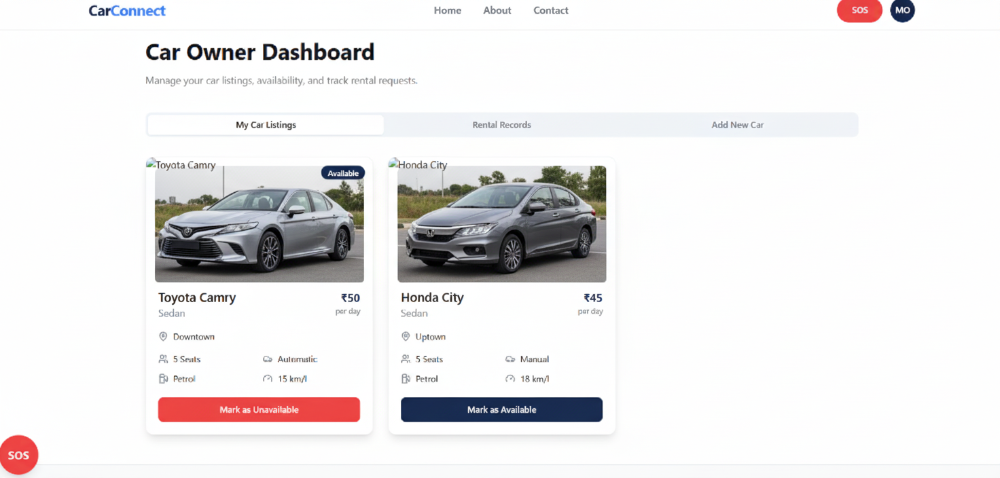
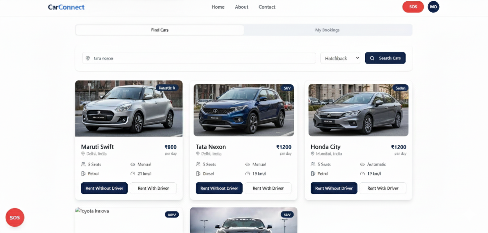
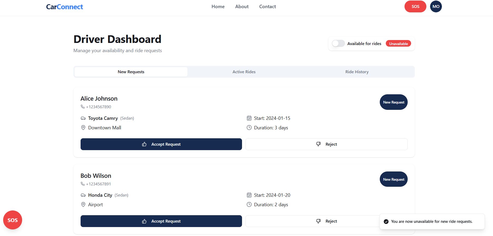

# CarConnect 🚗💨

[](https://reactjs.org/)
[](https://www.typescriptlang.org/)
[](https://nodejs.org/)
[](https://expressjs.com/)
[](https://www.mongodb.com/)

---

## 📖 About
**CarConnect** is a modern, full-stack web application that unifies **car rentals** and **carpooling**. Built with the **MERN stack** and **TypeScript**, it provides a seamless experience for both vehicle owners and users looking for transportation.  

Users can list their personal vehicles for rent or book cars, while the carpooling feature allows them to share rides along planned routes, promoting affordability and sustainability.

---

## ✨ Features

- **🚗 Car Rental System**  
  Owners can list their vehicles with details like model, price, and availability. Renters can browse, filter, and book cars securely.

- **🤝 Carpooling & Ride Sharing**  
  Users can post their travel routes (origin, destination, date) and offer seats to other passengers.

- **🔐 Secure User Authentication**  
  Complete authentication system for managing accounts, profiles, and bookings.

- **🔍 Advanced Search & Filtering**  
  Search for rental cars or carpool routes based on location, date, price, and more.

- **💬 Booking & Management**  
  Seamless booking process for rentals and carpool rides.

- **📱 Responsive UI**  
  Dynamic interface built with **React.js**, optimized for desktop and mobile devices.

---

## 🛠️ Tech Stack

| Frontend | Backend | Database | Authentication |
|----------|---------|----------|----------------|
| React.js + TypeScript | Node.js + Express.js | MongoDB + Mongoose | JWT |

---

## 📸 Screenshots

🔹 **Homepage & landing screen**  


🔹 **Carpool Ride Search**  


🔹 **Carrentals and Dashboards**  





---

## 🚀 Getting Started

Follow these steps to run the project locally:

```bash
# 1. Clone the repository
git clone https://github.com/mohitjeswani01/CarConnect.git

# 2. Navigate to the backend directory
cd CarConnect/backend

# 3. Install backend dependencies
npm install

# 4. Start the backend server
npm start

# 5. Open a new terminal and navigate to the frontend directory
cd ../frontend

# 6. Install frontend dependencies
npm install

# 7. Start the frontend development server
npm start
